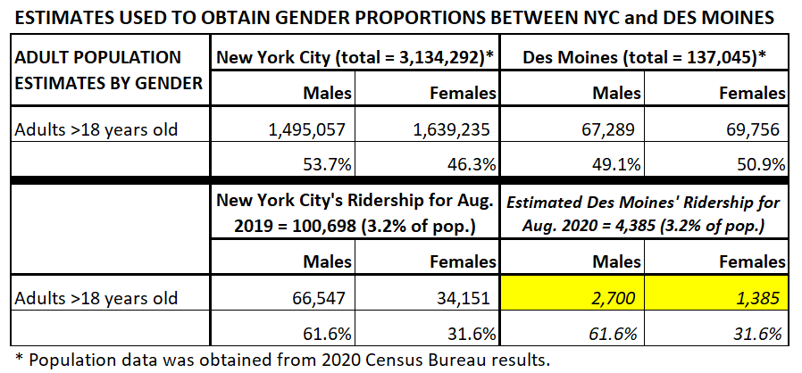
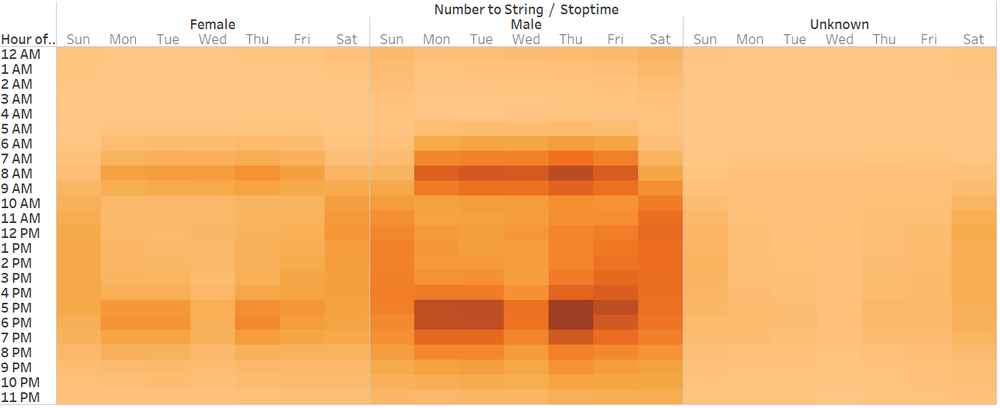

Why Bike Share for a business opportunity? Enter “Bike Share” in your search engine in any browser and you will see there are many cities adopting bike sharing programs. This map above shows bikesharing programs in the US by type of bike models. 
 
# Proposal for Bike-Sharing Program in Des Moines #
***(using New York City Bike Sharing Data)***

## Overview of the Analysis
Kate and I were approached by an investor who wished to provide a new service in the Des Moines area, Bike Sharing! The purpose for this new program is to:
(1)	offer bikes to tourists and residents that don’t have a bike and wish to ride,
(2)	promote and increase the use of the bike paths available in the city. From: [Des_Moines_Bike_Trails/](https://www.traillink.com/city/des-moines-ia-trails/)

(3)	possibly reduce the use of cars in the downtown area to decrease air pollution, and 
(4)	provide a service that is health conscious and easy for tourists AND residents to participate in.
This analysis will use data provided from a bikesharing entity in New York City (CitiBike) that collected pertinent information from their renters after every ride conducted in August 2019. These results will focus on several perspectives to:

A. Break down the population of bike riders in New York City . This will aid in finding ways to offer the program in a more cost- and energetic-effective way to the ridership.
     
B. Make the bikes available and distributable by scheduling maintenance for every bike, regardless of the popularity of the bike model. Here are possibly the two models that can be considered, the Lime and the regular male 10-speed bike. 
     
C. Find the gender of the riders and likewise provide the style of bike each gender type chooses (Male vs. Female style, i.e., with or without center support bar).
     
Using the data collected by CitiBike and applying the population proportion between NYC and Des Moines, we were able to compile estimates of how many bikes on the outset we would need to provide as well.

## Results
In order to normalize the data and make more accurate estimates across the named goals above, the following information was used to compile adult (18 to 65 years old) population proportions between New York City’s [NYC](https://www.census.gov/quickfacts/fact/table/newyorkcitynewyork,US/POP010220) and Des Moines’ [Des Moines](https://www.census.gov/quickfacts/fact/table/newyorkcitynewyork,US/POP010220) ridership populations.
	 

A.	**Breakdown the population to locate the most cost-effective placement of the workshop to distribute and maintain bikes.** By looking at the downtown area and the bike trails available, the below map shows several large hotels plus the State Capital. 

Another component to consider is the fact that most male and female riders appear to really stick to a 20-25 minute ride. The evidence can be seen in the bell curves seen for males (orange line) and females (blue) that both experience a dramatic drop right around the 20-minute mark.

Also, as seen in NYC, the highest weekend use is on Saturdays around lunchtime!

Can you see this as a perfect day?…rent a bike next to your hotel, ride to a restaurant or pick up lunch and go to a park nearby, return the bike and continue with your relaxing visit!

B.	**Compile a schedule per bike for routine maintenance, cleaning and repairs to occur:** From the CitiBike data, we can see in the table below that the best times to repair male and female bikes are Saturday and Sunday mornings. Female bikes also are not checked out after 7pm Wednesday evenings and male bikes are not checked out after 8pm.

C.	**Estimate of the population of gender of the bike riders in order to provide an appropriate model bike:** Roughly one-third of the NYC riders were female (N=34,151; blue line on graph below) and two-thirds were male (N=66,547; orange line on the graph below). NOTE: the “Unknown” (N=7,389; red line on the graph below) gender type was not included in the calculations in the above table.

Another helpful chart to look at is to see what kind of rider (Walk-in Customer vs. Subscriber). In the below chart, we can see that there are more males than females as Subscribers. Both male and female Subscribers appear to have chosen Thursday as a day to ride!

## Summary
A.	Looking at the chart showing the growths experienced by other bikesharing companies, NYC CitiBike is included in this bar chart and shows their first year (2013) had about 6 million trips. A monthly estimate would be 6M divided by 12 months=500,000. August 2019 shows 2,344,334 trips so proportionally, they started in 2013 with what would be 21.3% of the trips in August 2019. Considering the number of bikes they had in August 2019 (13,983) and keeping them mostly rented would mean they would have to have at least 2,978 bikes to start with. Given the different population of riders there would be in Des Moines (4,385), the total bikes we would need to start out with would be possibly the same proportion (3.2%) of the total, or, 140 bikes.

Given the observation that roughly 1/3 of the ridership were females and 2/3 were  male, the starter bikes that can be purchased on the estimated population of Des Moines riders will be: 93 are for males; 47 are female bikes.
B.	A schedule would have to be drawn up for the repair technicians giving them the best opportunity to get all maintenance completed when the bikes are available, i.e., not being ridden! Several charts on when bikes are available for repairs have been included in the “Results” section and the best times to repair are: 
1)	Not many male and female bikes are being ridden Saturday and Sunday mornings between 2am and 8am.
2)	After 7pm Wednesday evenings, female bikes are available. Male bikes are more available for repairs after 8pm Wednesday evenings.
3)	Special consideration should be paid attention to those riders (mostly male) who have chosen to be Subscribers. There should be special options provided for no cost to them, such as a mounted water bottle already loaded onto the bike before pick up. Maps to area restaurants and tourist spots can be provided free-of-charge. Also, other cost savings coupons can be given from other area businesses and hotels. The Chamber of Commerce can be petitioned to help provide advertising that would please even more tourists and fun seekers.
C.	From the provided charts above, there is a large difference in numbers between male and female riders. Not only do the numbers tell there are less female riders, but also less interest in becoming a Subscriber by females.

## DISCUSSION: WHAT TO PERFORM TO GET THIS STARTUP “Up and Running”
A.	A total of 140 bikes would need to be purchased together with all repair parts, lube, and tires.
B.	Extra staff (repair technicians) would need to work on Saturday and Sunday mornings since these two days had the least ridership and most bikes could have been returned and are waiting in the shop. .
C.	Find the best centrally located spot in relation to the bike trails present in the city as well as other attractions that have secure bike parking. Also take into account how far away city parks are for when a city event could occur and riders would prefer bikes rather than trying to park a car!

## WHAT DOES RESEARCH SHOW ABOUT THE SUCCESS OF BIKE SHARING?
>“An annual membership to **Citi Bike** is $169 a year or $14.95 a month, while a monthly pass to Metro Ride Share is $20. If you don't want to drive.” From April 4, 2018 [Policy_Genius](https://www.policygenius.com/news/)
>“The global bike sharing market was valued at $3.43 billion in 2019, and is projected to reach $6.98 billion by 2027.” From [Allied_Market_Research](https://www.alliedmarketresearch.com/bike-sharing-market-A11309)
>“Over the past decade, bike share has been one of the great U.S. transportation success stories. Starting with Tulsa, Oklahoma's program that launched in 2007, more than 60 U.S. cities now have bike-share systems, according to annual bike-share data from the National Association of City Transportation Officials (NACTO).“ from Dec. 16, 2019 [Last_Decade_Says_BikeSharing_Successful]( https://archive.curbed.com/2019/12/16/20864145/bike-share-citi-bike-jump-uber)

## FUTURE EYE ON THE PIECE OF “PIE”
**Future plans:** collect data similar to the NYC CitiBike Program obtained to aid in making other offerings to riders in the future.
**Ridership Programs Coalition:** reach out to other bikesharing organizations to see if partnerships can be developed.
**Get on newsletter lists:** Much like the National Association of City Transportation Officials (NACTO), good data can be obtained from this organization and others.

